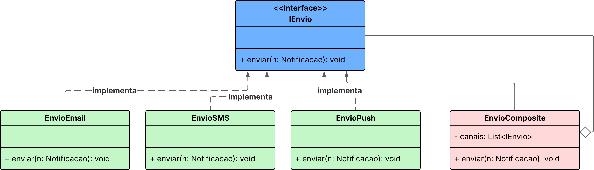

# 3.2. Módulo Padrões de Projeto GoFs Estruturais

## Padrões Estruturais

Ao modelar um sistema orientado a objetos, especialmente com múltiplas classes interconectadas, um dos principais desafios está em **organizar e estruturar as relações entre objetos e classes**, de forma que o sistema permaneça flexível, reutilizável e de fácil manutenção. Dentre eles:

1. **Composite**: O padrão Composite tem como principal objetivo permitir que objetos sejam organizados em estruturas hierárquicas de árvore, onde objetos individuais e composições desses objetos são tratados de maneira uniforme.

2. **Adapter**:  Em sistemas que precisam integrar bibliotecas externas ou componentes legados, sem comprometer a arquitetura interna. O Adapter converte a interface de uma classe existente para uma interface esperada pelo cliente, promovendo reuso, desacoplamento e isolamento de dependências externas.

---

Inicialmente, considerou-se a inclusão de estruturas condicionais dentro da classe Notificacao, que verificariam o tipo de alerta e executariam manualmente o envio por cada canal necessário. No entanto, essa abordagem resultaria em um alto acoplamento da classe Notificacao às implementações específicas de envio, dificultando sua manutenção e evolução — especialmente no caso da adição de novos canais no futuro.

Para solucionar esse problema, optou-se pela aplicação do padrão de projeto Composite, por meio da implementação da classe EnvioComposto. Essa classe implementa a interface IEnvio, assim como as implementações concretas EnvioEmail, EnvioSMS e EnvioPush. A diferença é que EnvioComposto agrega múltiplas estratégias de envio em uma estrutura unificada, permitindo que diversas notificações sejam enviadas simultaneamente, de forma transparente para o sistema.

---





<div style="text-align:center;">
Autores: Altino Arthur, Márcio Henrique e Daniel de Sousa
</div>


<br>

## Implementação em código - Composite

```java

public interface IEnvio {
    void enviar(Notificacao notificacao);
}

public class EnvioEmail implements IEnvio {
    @Override
    public void enviar(Notificacao notificacao) {
        System.out.println("Enviando Email para: " + notificacao.getDestinatario().getNome());
    }
}

public class EnvioSMS implements IEnvio {
    @Override
    public void enviar(Notificacao notificacao) {
        System.out.println("Enviando SMS para: " + notificacao.getDestinatario().getNome());
    }
}

public class EnvioPush implements IEnvio {
    @Override
    public void enviar(Notificacao notificacao) {
        System.out.println("Enviando Push para: " + notificacao.getDestinatario().getNome());
    }
}


public class EnvioComposite implements IEnvio {
    private List<IEnvio> canais = new ArrayList<>();

    public void adicionarCanal(IEnvio canal) {
        canais.add(canal);
    }

    @Override
    public void enviar(Notificacao notificacao) {
        for (IEnvio canal : canais) {
            canal.enviar(notificacao);
        }
    }
}


```

---

No decorrer das discussões, decidiu-se inserir lógica condicional no código cliente para lidar com cada tipo específico de sensor, como giroscópio ou acelerômetro. No entanto, essa abordagem introduziria alto acoplamento, aumento da complexidade e dificultaria a escalabilidade do sistema com a adição de novos sensores. Como já exemplificado em sala de aula — no caso dos vários caminhos possíveis entre um local e um destino — preencher o código com estruturas if-else seria uma solução "não elegante" e pouco sustentável.

Para contornar essa limitação, optou-se pela aplicação do padrão de projeto Adapter, por meio da criação da interface ISensorAdapter. Essa interface define os métodos esperados pelo sistema — como getDeltaGrau() e getDeltaTempo() — funcionando como um contrato único para qualquer sensor utilizado no processo de análise.

Cada tipo de sensor real (como o giroscópio e o acelerômetro) é encapsulado em sua respectiva classe adaptadora (GiroscopioAdapter, AcelerometroAdapter), que implementa a interface ISensorAdapter e traduz os dados e comportamentos do sensor original para o formato esperado pelo sistema.

Com isso, o componente TargetMonitoramento passa a trabalhar diretamente com objetos do tipo ISensorAdapter, abstraindo-se dos detalhes de implementação dos sensores concretos. Essa solução garante maior flexibilidade, facilidade de manutenção e prepara o sistema para a integração de novos sensores no futuro — bastando, para isso, implementar um novo adaptador compatível com a interface definida.

---


<div style="text-align:center;">
Autores: Altino Arthur, Márcio Henrique e Daniel de Sousa
</div>


<br>

## Implementação em código - Adapter

```java

import java.time.LocalDateTime;
import java.time.LocalDate;


public interface ISensorAdapter {
    float getDeltaGrau();
    int getDeltaTempo();
}

// Adaptee Acelerometro
public class Acelerometro {
    public float getAceleracaoX() {
        return 1.5f;
    }

    public float getAceleracaoY() {
        return 0.8f;
    }

    public String lerDadosBrutos() {
        return "dados acelerometro";
    }

    public void calibrar() {
        System.out.println("Acelerometro calibrado");
    }
}

// Adaptee Giroscopio

public class Giroscopio {
    public float getAnguloX() {
        return 10.5f;
    }

    public float getAnguloY() {
        return 5.2f;
    }

    public String lerDadosBrutos() {
        return "dados giroscopio";
    }

    public void calibrar() {
        System.out.println("Giroscopio calibrado");
    }
}


// Classe cliente: Monitoramento

public class Monitoramento {
    private Situacao situacao;
    private int deltaVariacaoGraus;
    private int tempoParadoSegundo;
    private LocalDateTime dataHora;
    private ISensorAdapter sensor;
    private ResultadoAnalise resultado;

    public Monitoramento(Situacao situacao, ISensorAdapter sensor) {
        this.situacao = situacao;
        this.sensor = sensor;
        this.deltaVariacaoGraus = Math.round(sensor.getDeltaGrau());
        this.tempoParadoSegundo = sensor.getDeltaTempo();
        this.dataHora = LocalDateTime.now();
        this.resultado = new ResultadoAnalise();
    }

    public String getResumo() {
        return "Situação: " + situacao +
                ", Graus: " + deltaVariacaoGraus +
                ", Tempo parado: " + tempoParadoSegundo + "s";
    }

    public ISensorAdapter getSensor() {
        return sensor;
    }

    public ResultadoAnalise getResultado() {
        return resultado;
    }
}

```


## Implementações das Classes

As implementações completas das classes mencionadas neste documento podem ser conferidas no repositório oficial do projeto, disponível em:

 [https://github.com/UnBArqDsw2025-1-Turma01/2025.1-T01-_G1_Embarcado_Entrega_03/tree/main/src/monitora](https://github.com/UnBArqDsw2025-1-Turma01/2025.1-T01-_G1_Embarcado_Entrega_03/tree/main/src/monitora)

O diretório `src/monitora` contém o código-fonte Java estruturado em pacotes.


## Referências

Arquitetura e Desenho de Software - AULA - GOFS ESTRUTURAIS - Profa. Milene Serrano - Material em Slides. SERRANO, Milene. Acesso em: 30 de maio de 2025.


## Histórico de Versões

| Versão | Commit da Versão                  | Data       | Descrição               | Autor(es)                                                                                                                                              | Revisor(es)                                  | Descrição da Revisão | Commit da Revisão                |
|:------:|:----------------------------------:|:----------:|:------------------------:|:------------------------------------------------------------------------------------------------------------------------------------------------------:|:--------------------------------------------:|:---------------------:|:-------------------------------:|
| 1.0    | [Ver Commit](https://github.com/UnBArqDsw2025-1-Turma01/2025.1-T01-_G1_Embarcado_Entrega_03/commit/93977f4fa9a9e69880452eaceab8cf332c214eaa) | 01/06/2025 | Adição do diagrama composite      | [Altino Arthur](https://github.com/arthurrochamoreira), [Márcio Henrique](https://github.com/DeM4rcio) e [Daniel de Sousa](https://github.com/daniel-de-sousa) | [Revisor](https://github.com/)               | —                     | —                             |
| 1.1    | [Ver Commit](https://github.com/UnBArqDsw2025-1-Turma01/2025.1-T01-_G1_Embarcado_Entrega_03/commit/d995cfbc16f834e49b46c88d8ef1cd5c8347fe06) | 02/06/2025 | Adição da Implementação composite      | [Altino Arthur](https://github.com/arthurrochamoreira), [Márcio Henrique](https://github.com/DeM4rcio) e [Daniel de Sousa](https://github.com/daniel-de-sousa) | [Revisor](https://github.com/)               | —                     | —                             |
| 1.2    | [Ver Commit](https://github.com/UnBArqDsw2025-1-Turma01/2025.1-T01-_G1_Embarcado_Entrega_03/commit/d7f807363fe47ba33e2cbfdf4a83088febdb461b) | 02/06/2025 | Adição da Implementação Adapter      | [Altino Arthur](https://github.com/arthurrochamoreira), [Márcio Henrique](https://github.com/DeM4rcio) e [Daniel de Sousa](https://github.com/daniel-de-sousa) | [Revisor](https://github.com/)               | —                     | —                             |
