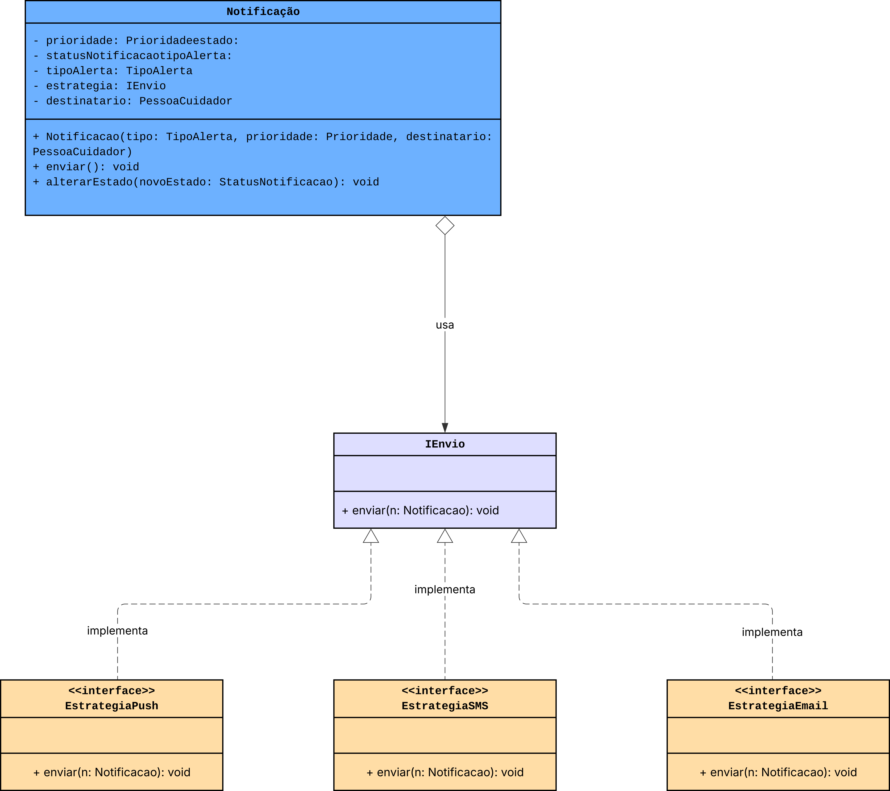
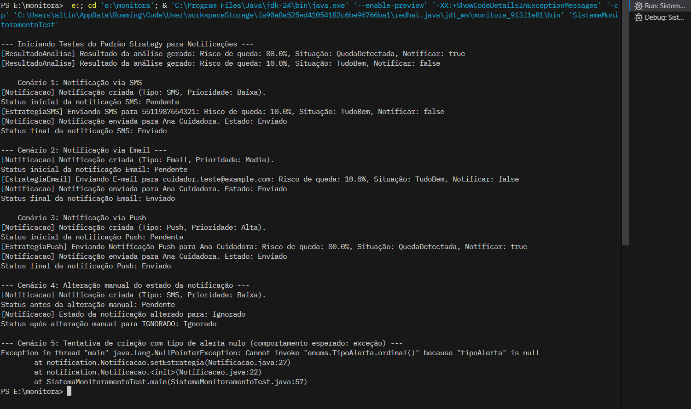

# 3.3. Módulo Padrões de Projeto GoFs Comportamentais

## Introdução

Os padrões comportamentais definidos pelos Gang of Four (GoF) tratam da forma como os objetos interagem e compartilham responsabilidades dentro de um sistema. Eles estabelecem modelos reutilizáveis que organizam a comunicação entre objetos, promovendo soluções eficazes para desafios recorrentes relacionados ao comportamento das classes.

Esses padrões são fundamentais para o desenvolvimento de sistemas flexíveis e bem estruturados. Ao adotá-los, os desenvolvedores conseguem dividir melhor as responsabilidades, tornar o código mais modular, facilitar a manutenção e permitir a evolução da aplicação com menor impacto estrutural. Além disso, esses padrões incentivam a reutilização e melhoram a legibilidade e organização da arquitetura.

## Strategy

O padrão Strategy permite encapsular diferentes algoritmos dentro de classes específicas e independentes, possibilitando que sejam alternados dinamicamente conforme a necessidade. Em vez de concentrar toda a lógica em um único método com várias ramificações (como `if` ou `switch`), o Strategy separa cada variação do comportamento em uma classe distinta.

Com isso, a aplicação pode selecionar e aplicar o algoritmo mais apropriado em tempo de execução, promovendo maior clareza, flexibilidade e facilidade de extensão. É ideal para cenários em que há múltiplas formas de realizar uma tarefa, e deseja-se trocar entre essas abordagens sem alterar o código principal.

## Aplicação do Padrão Strategy

Inicialmente, foi definida a interface `IEnvio`, que estabelece um contrato comum a todas as estratégias de envio. Essa interface declara o método `enviar(Notificacao notificacao)`, o qual deve ser obrigatoriamente implementado por todas as classes concretas que representam formas específicas de envio.

### Estratégias de Envio

A seguir, foram desenvolvidas as classes responsáveis por implementar os diferentes canais de notificação, cada uma encapsulando a lógica de envio correspondente:

- **EstrategiaSMS**: realiza o envio de mensagens de texto via SMS.
- **EstrategiaEmail**: gerencia o envio de e-mails a partir dos dados da notificação.
- **EstrategiaPush**: envia alertas do tipo push diretamente para dispositivos móveis.

Todas essas classes implementam a interface `IEnvio` e, assim, podem ser utilizadas de maneira intercambiável pelo sistema. Dessa forma, o padrão Strategy permitiu não apenas reduzir o acoplamento entre componentes, mas também viabilizou a possibilidade de extensão do sistema com novas formas de envio, sem necessidade de modificar as classes existentes.





<div style="text-align:center;">
Autores: Altino Arthur, Márcio Henrique e Daniel de Sousa
</div>

## Implementação em código - Strategy (Notificação)


```java
public interface IEnvio {
    void enviar(Notificacao n);
}
```

```java
public class EstrategiaEmail implements IEnvio {
    @Override
    public void enviar(Notificacao n) {
        System.out.println("[EstrategiaEmail] Enviando E-mail para " + n.getDestinatario().getContato().getEmail() + ": " + n.getBaseadaEmResultado().getResumo());
    }
}
```

```java
public class EstrategiaPush implements IEnvio {
    @Override
    public void enviar(Notificacao n) {
        System.out.println("[EstrategiaPush] Enviando Notificação Push para " + n.getDestinatario().getNome() + ": " + n.getBaseadaEmResultado().getResumo());
    }
}
```


```java
public class EstrategiaSMS implements IEnvio {
    @Override
    public void enviar(Notificacao n) {
        System.out.println("[EstrategiaSMS] Enviando SMS para " + n.getDestinatario().getContato().getTelefone() + ": " + n.getBaseadaEmResultado().getResumo());
    }
}
```

<div style="text-align:center;">
Autores: Altino Arthur, Márcio Henrique e Daniel de Sousa
</div>

## Testando o Strategy (Notificação)

```java
public class SistemaMonitoramentoTest {

    public static void main(String[] args) {
        System.out.println("\n--- Iniciando Testes do Padrão Strategy para Notificações ---");

        // Criar entidades necessárias para simular o cenário de notificação
        Contato contatoCuidador = new Contato("cuidador.teste@example.com", "5511987654321");
        Endereco enderecoCuidador = new Endereco("Rua dos Testes", "10", "Cidade Teste", "TS", "00000-000");
        PessoaCuidador cuidadorTeste = new PessoaCuidador("Ana Cuidadora", Genero.Feminino, "111.222.333-44", LocalDate.of(1985, 5, 10), contatoCuidador, enderecoCuidador);

        ResultadoAnalise resultadoQueda = new ResultadoAnalise(0.8, true, Situacao.QuedaDetectada);
        ResultadoAnalise resultadoNormal = new ResultadoAnalise(0.1, false, Situacao.TudoBem);

        System.out.println("\n--- Cenário 1: Notificação via SMS ---");
        Notificacao notificacaoSMS = new Notificacao(Prioridade.Baixa, TipoAlerta.SMS, cuidadorTeste, resultadoNormal);
        System.out.println("Status inicial da notificação SMS: " + notificacaoSMS.getEstado());
        notificacaoSMS.enviar();
        System.out.println("Status final da notificação SMS: " + notificacaoSMS.getEstado());
        if (notificacaoSMS.getEstado() != StatusNotificacao.Enviado) {
            System.err.println("ERRO: Status da notificação SMS não é ENVIADO.");
        }

        System.out.println("\n--- Cenário 2: Notificação via Email ---");
        Notificacao notificacaoEmail = new Notificacao(Prioridade.Media, TipoAlerta.Email, cuidadorTeste, resultadoNormal);
        System.out.println("Status inicial da notificação Email: " + notificacaoEmail.getEstado());
        notificacaoEmail.enviar();
        System.out.println("Status final da notificação Email: " + notificacaoEmail.getEstado());
        if (notificacaoEmail.getEstado() != StatusNotificacao.Enviado) {
            System.err.println("ERRO: Status da notificação Email não é ENVIADO.");
        }

        System.out.println("\n--- Cenário 3: Notificação via Push ---");
        Notificacao notificacaoPush = new Notificacao(Prioridade.Alta, TipoAlerta.Push, cuidadorTeste, resultadoQueda);
        System.out.println("Status inicial da notificação Push: " + notificacaoPush.getEstado());
        notificacaoPush.enviar();
        System.out.println("Status final da notificação Push: " + notificacaoPush.getEstado());
        if (notificacaoPush.getEstado() != StatusNotificacao.Enviado) {
            System.err.println("ERRO: Status da notificação Push não é ENVIADO.");
        }

        System.out.println("\n--- Cenário 4: Alteração manual do estado da notificação ---");
        Notificacao notificacaoManual = new Notificacao(Prioridade.Baixa, TipoAlerta.SMS, cuidadorTeste, resultadoNormal);
        System.out.println("Status antes da alteração manual: " + notificacaoManual.getEstado());
        notificacaoManual.alterarEstado(StatusNotificacao.Ignorado);
        System.out.println("Status após alteração manual para IGNORADO: " + notificacaoManual.getEstado());
        if (notificacaoManual.getEstado() != StatusNotificacao.Ignorado) {
            System.err.println("ERRO: Status da notificação manual não é IGNORADO.");
        }

        System.out.println("\n--- Cenário 5: Tentativa de criação com tipo de alerta nulo (comportamento esperado: exceção) ---");
        try {
            new Notificacao(Prioridade.Baixa, null, cuidadorTeste, resultadoNormal);
            System.err.println("ERRO: Nenhuma exceção lançada para TipoAlerta nulo.");
        } catch (IllegalArgumentException e) {
            System.out.println("Sucesso: Exceção capturada para TipoAlerta nulo: " + e.getMessage());
            if (!e.getMessage().contains("nulo")) {
                System.err.println("ERRO: Mensagem de exceção inesperada para TipoAlerta nulo.");
            }
        }

        System.out.println("\n--- Todos os Testes de Notificação Strategy Concluídos ---");
    }
}
```

<div style="text-align:center;">
Autores: Altino Arthur, Márcio Henrique e Daniel de Sousa
</div>

## Resultados dos Testes Strategy





<div style="text-align:center;">
Autores: Altino Arthur, Márcio Henrique e Daniel de Sousa
</div>

### Observer: Gerenciando Eventos com Baixo Acoplamento

No desenvolvimento do sistema de monitoramento, foi identificado o requisito de notificar automaticamente diversos componentes sempre que um evento relevante como a detecção de uma queda ocorresse. A abordagem tradicional, baseada em chamadas diretas entre módulos, tornaria o sistema fortemente acoplado e difícil de escalar. Para resolver essa limitação, optou-se pela adoção do padrão de projeto **Observer**, pertencente à categoria dos padrões comportamentais.

#### Aplicação do Padrão Observer

O padrão Observer estabelece uma relação de dependência entre um objeto "sujeito" (observável) e um conjunto de objetos "observadores", de modo que, sempre que o estado do sujeito muda, todos os observadores são automaticamente notificados.

##### Interface de Observação (ListenerQueda)

Inicialmente, foi definida a interface `ListenerQueda`, que representa o contrato que qualquer classe interessada em receber notificações de eventos de queda deve implementar. Essa interface declara o método `onQuedaDetectada(Monitoramento m, ResultadoAnalise r)`, que é invocado sempre que uma nova situação crítica é identificada.

##### Observadores Concretos

A seguir, foram implementadas as classes que atuam como observadores do sistema:

- **NotificadorCuidador**: ao ser notificado sobre uma queda, é responsável por compor e disparar uma notificação ao cuidador responsável.
- **RegistradorLog**: registra os eventos de queda em um log centralizado. Essa classe foi projetada também como um Singleton, garantindo que apenas uma instância gerencie os registros de log.

Ambas as classes implementam a interface `ListenerQueda` e são registradas no componente observável.

##### Sujeito Observável (ServicoMonitoramento)

A classe `ServicoMonitoramento` atua como o sujeito observável. Ela mantém uma lista de objetos `ListenerQueda` previamente registrados. Quando o método `processarMonitoramento()` detecta uma queda, o serviço invoca o método `notificarObservadores()`, que por sua vez aciona todos os observadores registrados.

Importante destacar que `ServicoMonitoramento` não precisa conhecer os detalhes de implementação dos observadores — apenas emite o evento. Cada observador responde ao evento de forma independente, promovendo o princípio do baixo acoplamento.

#### Vantagens da Solução

A adoção do padrão Observer trouxe uma série de benefícios arquiteturais ao sistema, destacando-se:

- **Baixo acoplamento** entre o módulo de detecção e os módulos que reagem ao evento;
- **Alta extensibilidade**, permitindo adicionar novos observadores sem modificar o código existente;
- **Facilidade de manutenção**, já que novas funcionalidades podem ser integradas com mínimo impacto no sistema.

Caso haja a necessidade futura de incorporar novos comportamentos em resposta a eventos de queda (como acionar um alarme local ou alimentar um painel estatístico), basta implementar uma nova classe que estenda `ListenerQueda` e registrá-la no `ServicoMonitoramento`. Nenhuma alteração será necessária nas classes já existentes, garantindo uma evolução sustentável do código.


## Implementação em código - Observadores

```java
public interface ListenerQueda {
    void onQuedaDetectada(Monitoramento m, ResultadoAnalise r);
}

class NotificadorCuidador implements ListenerQueda {
    @Override
    public void onQuedaDetectada(Monitoramento m, ResultadoAnalise r) {
        System.out.println("[NotificadorCuidador] Queda detectada! Preparando notificação para " + m.getCuidadorAssociado().getNome());
    }
}
```

```java
public class NotificadorCuidador implements ListenerQueda {
    @Override
    public void onQuedaDetectada(Monitoramento m, ResultadoAnalise r) {
        System.out.println("[NotificadorCuidador] Queda detectada! Preparando notificação para " + m.getCuidadorAssociado().getNome());
    }
}
```

```java
public class RegistradorLog implements ListenerQueda {
    private static RegistradorLog instance;

    private RegistradorLog() {
        // Construtor privado para implementar o Singleton
        System.out.println("[RegistradorLog] Instância do RegistradorLog criada.");
    }

    public static RegistradorLog getInstance() {
        if (instance == null) {
            instance = new RegistradorLog();
        }
        return instance;
    }

    @Override
    public void onQuedaDetectada(Monitoramento m, ResultadoAnalise r) {
        System.out.println("[RegistradorLog] Queda detectada e registrada no log. " + m.getResumo() + " - Risco: " + r.getRiscoQueda());
    }
}
```
<div style="text-align:center;">
Autores: Altino Arthur, Márcio Henrique e Daniel de Sousa
</div>

## Testando os Observadores

```java
public class SistemaMonitoramentoTest {

    public static void main(String[] args) {
        System.out.println("--- Iniciando Testes do Padrão Observer ---");

        // 1. Criar entidades necessárias para simular o cenário de monitoramento e queda
        Contato contatoCuidador = new Contato("joao.cuidador@example.com", "5511912345678");
        Endereco enderecoCuidador = new Endereco("Rua da Guarda", "789", "Cidade Segura", "SP", "12345-678");
        PessoaCuidador joao = new PessoaCuidador("João Guardião", Genero.Masculino, "012.345.678-90", LocalDate.of(1970, 1, 1), contatoCuidador, enderecoCuidador);

        Contato contatoMonitorado = new Contato("maria.monitorada@example.com", "5511987654321");
        Endereco enderecoMonitorado = new Endereco("Av. Paz", "1000", "Cidade Tranquila", "MG", "98765-432");
        PessoaMonitorada maria = new PessoaMonitorada("Maria Paciente", Genero.Feminino, "908.765.432-10", LocalDate.of(1930, 12, 1), contatoMonitorado, enderecoMonitorado);

        // Associar o cuidador à pessoa monitorada
        maria.adicionarCuidador(joao);
        joao.adicionarPessoaMonitorada(maria);

        // Criar um sensor associado à pessoa monitorada
        Sensor sensorSala = new Sensor("Acelerômetro", "Sala de Estar", LocalDate.of(2025, 5, 20));
        maria.adicionarSensor(sensorSala);

        // Instanciar o Serviço de Monitoramento (o Sujeito/Observable)
        ServicoMonitoramento servicoMonitoramento = new ServicoMonitoramento();

        // **Atenção**: Por padrão, NotificadorCuidador e RegistradorLog já são adicionados
        // como observadores no construtor de ServicoMonitoramento.
        // Se você quisesse adicionar outros ou remover os padrões, faria aqui:
        // servicoMonitoramento.adicionarObservador(new MeuNovoObservador());
        // servicoMonitoramento.removerObservador(RegistradorLog.getInstance());

        System.out.println("\n--- Cenário de Teste 1: Queda Detectada ---");
        System.out.println("Simulando um monitoramento com dados que indicam queda (delta: 60, tempo parado: 20)...");
        
        // Criar um monitoramento com dados críticos
        Monitoramento monitoramentoQueda = servicoMonitoramento.criarMonitoramento(joao, maria, sensorSala, 60, 20);
        
        // Processar o monitoramento. Isso deve acionar a notificação dos observadores.
        servicoMonitoramento.processarMonitoramento(monitoramentoQueda);

        System.out.println("\n--- Verificando a Reação dos Observadores ---");
        // Após o processamento, as mensagens do NotificadorCuidador e do RegistradorLog
        // devem ter sido impressas no console, indicando que foram notificados.
        System.out.println("Verifique as mensagens acima para confirmar que 'NotificadorCuidador' e 'RegistradorLog' reagiram à queda detectada.");
        // Você poderia adicionar asserções mais robustas aqui se estivesse usando JUnit,
        // por exemplo, verificando logs de um Mock de RegistradorLog ou um Mock de NotificadorCuidador.

        System.out.println("\n--- Cenário de Teste 2: Situação Normal (Sem Queda) ---");
        System.out.println("Simulando um monitoramento com dados normais (delta: 10, tempo parado: 2)...");
        
        // Criar um monitoramento com dados normais
        Monitoramento monitoramentoNormal = servicoMonitoramento.criarMonitoramento(joao, maria, sensorSala, 10, 2);
        
        // Processar o monitoramento. Isso NÃO deve acionar a notificação dos observadores.
        servicoMonitoramento.processarMonitoramento(monitoramentoNormal);

        System.out.println("\n--- Verificando a Não-Reação dos Observadores ---");
        // Após o processamento, as mensagens dos observadores NÃO devem ter sido impressas,
        // pois a situação não é crítica.
        System.out.println("Verifique as mensagens acima para confirmar que 'NotificadorCuidador' e 'RegistradorLog' NÃO reagiram a esta situação normal.");

        System.out.println("\n--- Testes do Padrão Observer Concluídos ---");
    }
}
```

<div style="text-align:center;">
Autores: Altino Arthur, Márcio Henrique e Daniel de Sousa
</div>

## Resultados dos Testes Observadores

```text
PS E:\monitora>  e:; cd 'e:\monitora'; & 'C:\Program Files\Java\jdk-24\bin\java.exe' '--enable-preview' '-XX:+ShowCodeDetailsInExceptionMessages' '-cp' 'C:\Users\altin\AppData\Roaming\Code\User\workspaceStorage\fa90a8a525ed41054182c6be96766ba1\redhat.java\jdt_ws\monitora_9f3f1e81\bin' 'SistemaMonitoramentoTest' 
--- Iniciando Testes do Padrão Observer ---
[PessoaMonitorada] Maria Paciente agora é monitorada por João Guardião.
[PessoaCuidador] João Guardião agora monitora Maria Paciente
[Sensor] Sensor criado: Sensor ID: 767dee38-a9ae-4b4c-b4d5-b8e6e3c33b76, Tipo: Acelerômetro, Localização: Sala de Estar (Calibração: 2025-05-20).
[PessoaMonitorada] Maria Paciente associou o sensor Acelerômetro (767dee38-a9ae-4b4c-b4d5-b8e6e3c33b76).
[SensorValidator] SensorValidator inicializado.
[ServicoQueda] ServicoQueda inicializado.
[AnalisadorPostura] AnalisadorPostura inicializado.
[RegistradorLog] Instância do RegistradorLog criada.
[ServicoMonitoramento] Observador RegistradorLog adicionado.
[ServicoMonitoramento] ServicoMonitoramento inicializado.

--- Cenário de Teste 1: Queda Detectada ---
Simulando um monitoramento com dados que indicam queda (delta: 60, tempo parado: 20)...
[Monitoramento] Novo monitoramento criado para Maria Paciente com sensor Acelerômetro.
[PessoaMonitorada] Maria Paciente adicionou um novo registro de monitoramento.
[ServicoMonitoramento] Monitoramento criado com sucesso.
[ServicoMonitoramento] Processando monitoramento para Maria Paciente...
[AnalisadorPostura] Normalizando ângulo 90 para 90.
[ServicoMonitoramento] DEBUG: AnalisadorPostura - normalizando 90 graus: 90
[AnalisadorPostura] Normalizando ângulo 180 para 180.
[AnalisadorPostura] Normalizando ângulo 0 para 0.
[AnalisadorPostura] Calculando variação de ângulo: 0 -> 180 = 180 graus.
[ServicoMonitoramento] DEBUG: AnalisadorPostura - calculando variacao (0 a 180): 180
[ServicoQueda] Analisando dados do monitoramento...
[SensorValidator] Verificando calibração do sensor 767dee38-a9ae-4b4c-b4d5-b8e6e3c33b76...
[Sensor] Sensor 767dee38-a9ae-4b4c-b4d5-b8e6e3c33b76 está calibrado.
[ServicoQueda] Análise concluída: Risco=90.0%, Situação=QuedaDetectada, Notificar=true.
[ResultadoAnalise] Resultado da análise gerado: Risco de queda: 90.0%, Situação: QuedaDetectada, Notificar: true
[Monitoramento] Resultado da análise aplicado ao monitoramento. Nova situação: QuedaDetectada
[ServicoMonitoramento] Situação crítica detectada: QuedaDetectada. Notificando observadores.
[RegistradorLog] Queda detectada e registrada no log. Monitoramento em 2025-06-02T04:13:34.117433200 com sensor Acelerômetro. Situação: QuedaDetectada - Risco: 0.9
[ServicoMonitoramento] Criando notificação para João Guardião (Prioridade: Alta, Tipo: Push).
[Notificacao] Notificação criada (Tipo: Push, Prioridade: Alta).
[EstrategiaPush] Enviando Notificação Push para João Guardião: Risco de queda: 90.0%, Situação: QuedaDetectada, Notificar: true
[Notificacao] Notificação enviada para João Guardião. Estado: Enviado

--- Verificando a Reação dos Observadores ---
Verifique as mensagens acima para confirmar que 'NotificadorCuidador' e 'RegistradorLog' reagiram à queda detectada.

--- Cenário de Teste 2: Situação Normal (Sem Queda) ---
Simulando um monitoramento com dados normais (delta: 10, tempo parado: 2)...
[Monitoramento] Novo monitoramento criado para Maria Paciente com sensor Acelerômetro.
[PessoaMonitorada] Maria Paciente adicionou um novo registro de monitoramento.
[ServicoMonitoramento] Monitoramento criado com sucesso.
[ServicoMonitoramento] Processando monitoramento para Maria Paciente...
[AnalisadorPostura] Normalizando ângulo 90 para 90.
[ServicoMonitoramento] DEBUG: AnalisadorPostura - normalizando 90 graus: 90
[AnalisadorPostura] Normalizando ângulo 180 para 180.
[AnalisadorPostura] Normalizando ângulo 0 para 0.
[AnalisadorPostura] Calculando variação de ângulo: 0 -> 180 = 180 graus.
[ServicoMonitoramento] DEBUG: AnalisadorPostura - calculando variacao (0 a 180): 180
[ServicoQueda] Analisando dados do monitoramento...
[SensorValidator] Verificando calibração do sensor 767dee38-a9ae-4b4c-b4d5-b8e6e3c33b76...
[Sensor] Sensor 767dee38-a9ae-4b4c-b4d5-b8e6e3c33b76 está calibrado.
[ServicoQueda] Análise concluída: Risco=10.0%, Situação=TudoBem, Notificar=false.
[ResultadoAnalise] Resultado da análise gerado: Risco de queda: 10.0%, Situação: TudoBem, Notificar: false
[Monitoramento] Resultado da análise aplicado ao monitoramento. Nova situação: TudoBem
[ServicoMonitoramento] Situação normal: TudoBem.

--- Verificando a Não-Reação dos Observadores ---
Verifique as mensagens acima para confirmar que 'NotificadorCuidador' e 'RegistradorLog' NÃO reagiram a esta situação normal.

--- Testes do Padrão Observer Concluídos ---
PS E:\monitora>     
```

<div style="text-align:center;">
Autores: Altino Arthur, Márcio Henrique e Daniel de Sousa
</div>

## Implementações das Classes

As implementações completas das classes mencionadas neste documento podem ser conferidas no repositório oficial do projeto, disponível em:

 [https://github.com/UnBArqDsw2025-1-Turma01/2025.1-T01-_G1_Embarcado_Entrega_03/tree/main/src/monitora](https://github.com/UnBArqDsw2025-1-Turma01/2025.1-T01-_G1_Embarcado_Entrega_03/tree/main/src/monitora)

O diretório `src/monitora` contém o código-fonte Java estruturado em pacotes.

## Referências

REFACTORING GURU. Padrões de projeto comportamentais. Disponível em: https://refactoring.guru/pt-br/design-patterns/behavioral-patterns. Acesso em: 30 de maio de 2025.

## Histórico de Versões

| Versão | Commit da Versão                  | Data       | Descrição               | Autor(es)                                                                                                                                              | Revisor(es)                                  | Descrição da Revisão | Commit da Revisão                |
|:------:|:----------------------------------:|:----------:|:------------------------:|:------------------------------------------------------------------------------------------------------------------------------------------------------:|:--------------------------------------------:|:---------------------:|:-------------------------------:|
| 1.0    | [Ver Commit](https://github.com/UnBArqDsw2025-1-Turma01/2025.1-T01-_G1_Embarcado_Entrega_03/commit/5cb51fb894c7a72436e83b65cc56450e1908c811) | 01/06/2025 | Adição do diagrama e representação da implemetação em código java      | [Altino Arthur](https://github.com/arthurrochamoreira), [Márcio Henrique](https://github.com/DeM4rcio) e [Daniel de Sousa](https://github.com/daniel-de-sousa) | [Revisor](https://github.com/)               | —                     | —                             |
