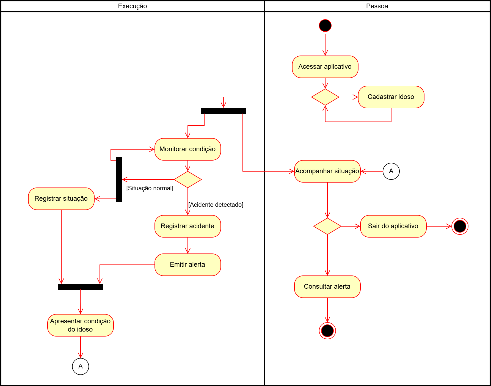

## Diagrama de Atividades

O diagrama de atividades é uma representação gráfica que captura as ações e seus resultados dentro de um sistema. Ele foca nas atividades realizadas durante a execução de um processo, normalmente vinculadas à implementação de um método ou operação, dentro de uma instância específica de um objeto. Esse tipo de diagrama é especialmente útil para ilustrar o fluxo de controle e trabalho, detalhando como e quando as ações ocorrem.

Embora o diagrama de atividades compartilhe semelhanças com o diagrama de estados, seu objetivo é ligeiramente diferente. Enquanto o diagrama de estados mostra as mudanças de estado de um objeto, o diagrama de atividades se concentra nas ações a serem executadas e nas transições entre essas ações, orientadas por fluxos de controle. [[1]](#ref1)

Para organizar esse fluxo, utilizam-se diversos nós de controle [(UML DIAGRAMS, 2025)](#ref2), que ajudam a coordenar a execução das atividades:

- **Nó Inicial:** Indica o início do fluxo da atividade.

- **Nó Final de Fluxo**: Indica o fim de uma linha de execução, mas não necessariamente o fim de toda a atividade.

- **Nó Final da Atividade:** Representa o encerramento completo da atividade.

- **Nó de Decisão:** Permite criar ramificações no fluxo, baseadas em condições.

- **Nó de Mesclagem:** Reúne fluxos alternativos que foram separados por uma decisão anterior.

- **Nó de Bifurcação:** Permite que múltiplas atividades sejam executadas em paralelo.

- **Nó de Junção:** Sincroniza as atividades paralelas antes que o fluxo prossiga.

### Versão 1.0

A **Figura 1** abaixo apresenta a versão 1.1 do diagrama de atividades, onde houve as seguintes adições:

- Adição das ações;
- Adição dos nós de controle;
- Adição dos quadros `Execução` e `Pessoa`.

  
<strong>Figura 1 – Diagrama de Atividades Versão 1.0</strong>

  
  
Autor: <a href="https://github.com/MatheusHenrickSantos">Matheus Henrick</a>.

### Versão 1.1

A **Figura 2** abaixo apresenta a versão 1.1 do diagrama de atividades, onde houve as seguintes mudanças:

- Renomear `Execução` para `Aplicativo`;
- Mover `Cadastrar idoso` para `Aplicativo`.

  
<strong>Figura 2 – Diagrama de Atividades Versão 1.1</strong>

  
  
Autor: <a href="https://github.com/MatheusHenrickSantos">Matheus Henrick</a>.

### Diagrama de Atividades Incorporado

  
<strong>Diagrama de Atividades Incorporado</strong>

  <iframe allowfullscreen frameborder="0" style="width:960px; height:720px" src="https://viewer.diagrams.net/?tags=%7B%7D&lightbox=1&highlight=0000ff&edit=_blank&layers=1&nav=1&title=diagrama-de-atividades.drawio&dark=auto#R%3Cmxfile%3E%3Cdiagram%20id%3D%22kvMhK4vXqCjmHUlBjYWa%22%20name%3D%22P%C3%A1gina-1%22%3E7V3dk5s2EP9r%2FOgMQgLsx7Pv0naazGR6D22fMpzR2bQYuYDju%2Fz1FUbiQwIjcxYc9mWmjRFCCO3ubz%2B0q0zgcvvyS%2BTuNl%2BJh4OJaXgvE3g%2FMU3g2HP6V9rymrVYDsoa1pHvsU5Fw6P%2FE7NGg7XufQ%2FHlY4JIUHi76qNKxKGeJVU2twoIodqt2cSVN%2B6c9dYanhcuYHc%2BqfvJZusdWY6Rfuv2F9v%2BJsB%2F%2BCtyzuzL4k3rkcOpSb4MIHLiJAk%2B7V9WeIgXTy%2BLtlznxvu5hOLcJioPOA4T3e%2F%2F%2Fb4Hf3zPToYm%2BnuOThMERvmhxvs2Rd%2Fw3FMXDbn5JUvRHzwt4Eb0qvFJtkGtBHQn3HiRgmjGn0%2FXDyTMHlkT6XXKxIE7i72n%2FKWDYn8n7SXm4%2FBRv7ip6OzYSPyb77gZqnTZz8IliQg0XFW8Pn4h94%2FbPwEP%2B7cVTrEgfIibWOfhqMEvzQuGshJQXkYky1OolfahT0whZx8jH8huzwUzIA4r25KjOAg1ugyBlznYxc0oj8Ymc4gGYQSyZYkjPcBJUX6voB%2Br0y%2BiOxDD3tsfetWq0RVN1oxmiJO09KaG8c%2FabtMi5WRU69yhz2hRJETjNpIJwtVqGQZMpmAWUMmfVQyJSrdrch254abI5liP9m7kyWc3DnH%2F0Ny4yQz50OTzKqhGMXCTKp2gb9yE%2F%2FH7ZGpin9geMmSyCSRhI5C7QNRVW3cXXo%2FU1mJm2B5oXMCDLDQc6tN0cCaZYa6lhkpLLNHTSV2SaJkQ9YkdIOHorW8%2FOmKUREK7gJ%2FHdK2J5IkZEtv4NC7Sw21dJAdDrMWJiSzk6QoJM84PkU%2F%2B6%2F04pPFL%2F8u37t%2FqVy98qsXPyk9Rq%2F%2BZlNOfxcPpRf8mWwp0u%2BvsEBM9tEKt%2FOuIqtQU9eN1vhUR6uepSIcpGBVnV0di7BHvxGfzqewekxYZUaArOoY2cTYYwKn5fPoznzOG2U85aB3KOHzqpEys4YVcdP%2BkPGzZVxZdtvBACoKuaNHyHOhZvxoWwKjNQi5PJKgumxbGChbCm1owV9XttzU8EKbqJuguiS5dh9K1m3Z0R%2BLrIOKpBeC3ybrJUkv5H4gWecs2irrmd94eWGHhhDHcLoKu2m3jNQg7ZQp3NdSt13aIW6esinOGBgnJ9bSn%2F7IZnBR6IHz0YrVVahQU1WFGhMdYkWNuArPAaOrWAGrbSTdSlS2uR9dP419eOSmAyDAqQaq4OCBKnumADrjc48gEgB8cJtpxODezWYCk%2F5splbM5mzeblzpcZAcu8KOltkR2qEQTMn3i3pCdkd2j2QM35Dt0z5ux%2B%2Brg%2FdZNShTBzpWn6DjmOMFnSuwKB1lRw1qAR0Aq9YGAmqR19aBoBjd0Y064w04jEB5Xo6PNSlPYAp8bHTlY2EgKJrVmvkY1QQXm32hG82SmYmxl5osmVmvWTJAJtvD1k%2BODu21psg0xDi4GQqqNLLA0H4slDMu%2FsBrn65NlnOx8j36xfjWCYXQ4IT62CjUoct5YmhrlNNS1OVAT5QTClFOOOvqCSMxx6VfXQ4U8gqu2RNuwR2ROraMO726wkDWD19J6Cck0w8rEnr%2BladQnqcp4ODJeWB8IdM%2Bt4tVEZ8DVXv%2Blx7Enwt8JYq4KuA73SKfzVvFl9YIpuwmTKzFY01ythGSaEu9Meu%2BlqG%2FuE84EPCEsewqNWKjGl7e%2Bp535PcIx%2F5Pt3D%2B2PfSwa1F%2BsIad7ARU1ghDBttkpeftDJnJrqNWGN8si2TReTfak9UPXoxwkWen2OsRf%2BbKrnD7wudrsmOBcp2rJ6YlJiUBeYdYU0aSEyP1WzHmgp2bIlLq3CyoB%2B9LP9nHTFtye6A0p1pcQs0PgRqHzqi1g5HPv3WFPxKsvStaF2QfRL4IRUEXr2XMmJGhsd0szqd9X4bfPGfcXAMfNGPiZK03imJXP%2FIltiNkwOO6c9FiA8lQb2fOJSn7f%2F2aYXdYrWPflCxyq8n8C6dbdHABa%2Faw7k%2F3koo35FUwufcBOQvcfcJka3C3FrUZvshIeRm1tl%2BNaaf6LtdLpt4fKbfG8EVKEHrlCNwie%2BzoG%2FGkWV9rhF8TVWTEuipKRBcla7QC4TsQ9BzmhRSKU24Ki5%2FXyaEKhdDTVwslgN3TQqRBuo5FIZqcsisxV0ecjc8ilTUjfDIQB5Po%2BLs7OCgBquycHBMZ1YhypS98o1MYwFhVGEEfQ4PknVyeYflFoqQT1tRM0EKB8%2Ft5AHWD9O%2BH9O%2Bd7vdFLNcoZxw1qvdbpmjs2jqQraNdkmT%2Bd013adfs53jwWBmO2xg17NjJuImojiQZoOHHzcxIja%2FYAFcB%2Ff0%2FbA2aohMvzUMLRxtYYplq8rb2oIVIUW0L1URJ%2FgMqK0i7nR%2FPRVxluwg6y%2FGPa1yxZiBUxMq67WwxBpxqKyMReAEEuW4cm4M4ThE72DEPaX2fFlTj54VPZGuhYSi0OsqzwWCHWuh02DU0l8PGNkKtu2HN6V3o6RX7yoPB3Muq8lE7tW7ske85awaLa4gfdkna0mjqUX6ft0rzgtDwb5og6KusC8N1HOZhC27V3e7CMeUTo3Jelllue%2BR%2BObijkDIILDNGpzqt6hcTrYcDVB13diam3YVrgx0GrCGcJO5DdMOUUiPZSokA1pm10ouq0E39wVRH1UMQ27dcg3RntOqqSJROGHF6lrFIA3E8xn74uPRsvHU%2BGRAIZhpnAoiNFqJXThcxbJsjxMoH%2BGpalma2gpwBTblIY6ezvBEIzYoOgbcK8zYvCPVv5uDVI%2BaRHrcHFtIVpSytlSxVxpI8VSDc6Nbebl6nuHbEt0S09LO7c8qJbRGw9B4NUdHiTznSIaeJVLVqkd6zhkZnUSKp4MJEnNuf00SJsebl67n8nyr2wx1zAQotWoSXnoNdSCFmOwNlwELO1Fg6DJgeNsnCTUqrUvVFai6PsoVBJrOMEZ2FUicrkcKoZkYfO03FQndXirShd30LuyrWnyoyeCaiudTA1G%2FqZ%2FALY50sdoBeln8g3RZ9%2BKf9YMP%2FwM%3D%3C%2Fdiagram%3E%3C%2Fmxfile%3E#%7B%22pageId%22%3A%22kvMhK4vXqCjmHUlBjYWa%22%7D" id="D8RdfbWlaboS"></iframe>
  
Autor: <a href="https://github.com/MatheusHenrickSantos">Matheus Henrick</a>.

---

## Referências 

[[1]](#diagrama-de-atividades) Material Complementar - Modelagem UML (Diagrama de Estados). Disponível em: [[Aprender3]](https://aprender3.unb.br/pluginfile.php/3075176/mod_page/content/1/Material%20Complementar%20T%C3%B3pico%202%20-%20DSW%20-%20Modelagem%20A.zip). Acesso em: 7 maio 2025.

[[2]](#diagrama-de-atividades) UML DIAGRAMS. Activity Diagram Control Nodes. Disponível em: https://www.uml-diagrams.org/activity-diagrams-controls.html. Acesso em: 8 maio 2025.

## Histórico de Versões

| Versão | Commit da Versão | Data | Descrição | Autor(es) | Revisor(es) | Descrição da Revisão | Commit da Revisão |
|:------:|:----------------:|:----:|:---------:|:---------:|:-----------:|:--------------------:|:-----------------:|
| 0.1    | [Ver Commit](https://github.com/UnBArqDsw2025-1-Turma01/2025.1-T01-_G1_Embarcado_Entrega_03/commit/0faceb7feecbf82014784dd561d10555901b1eab) | 08/05/2025 | Criação do documento | [Matheus Henrick](https://github.com/MatheusHenrickSantos) | [Revisor](https://github.com/) | *(inserir observações da revisão)* | [Ver Commit](https://github.com/) |
